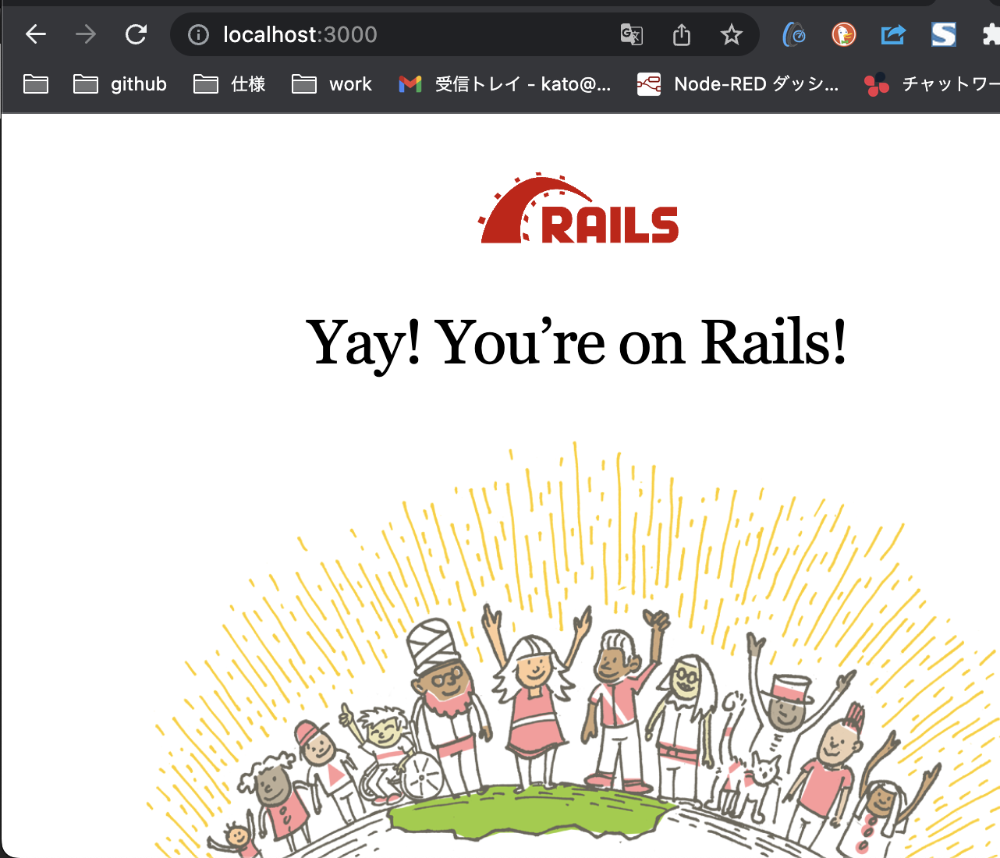
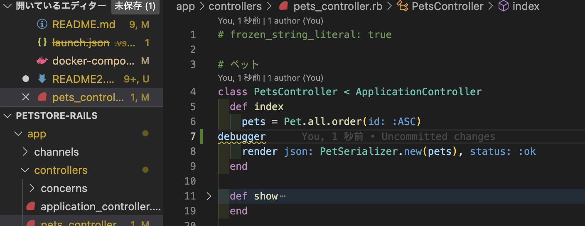
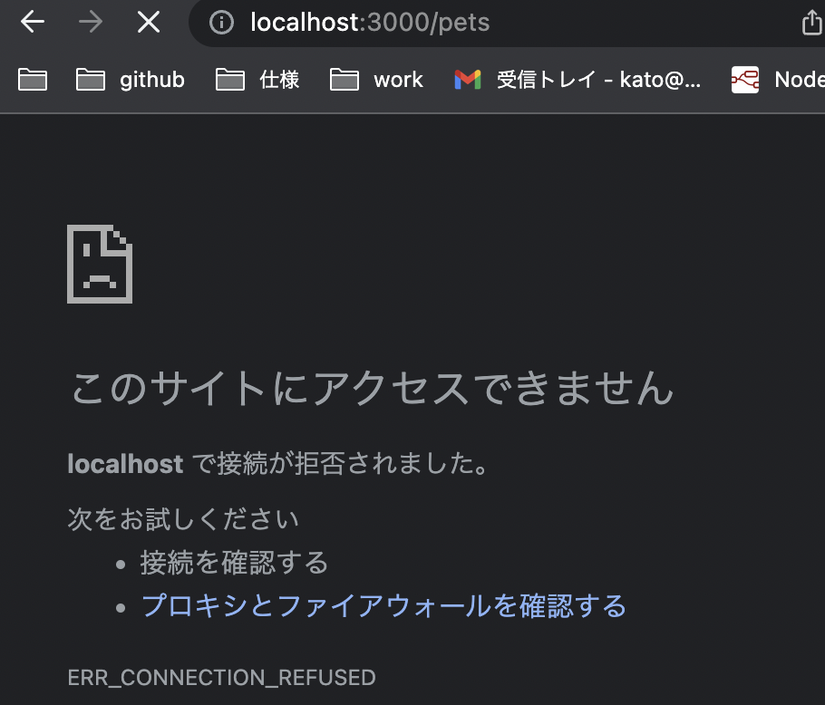
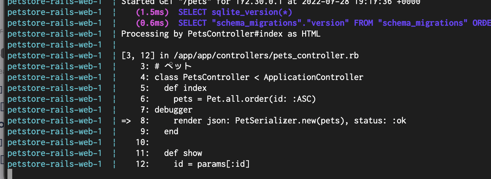
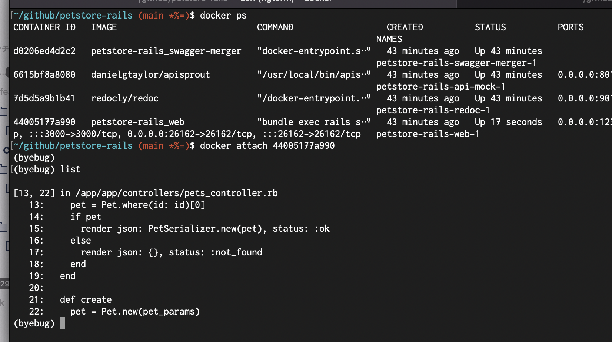
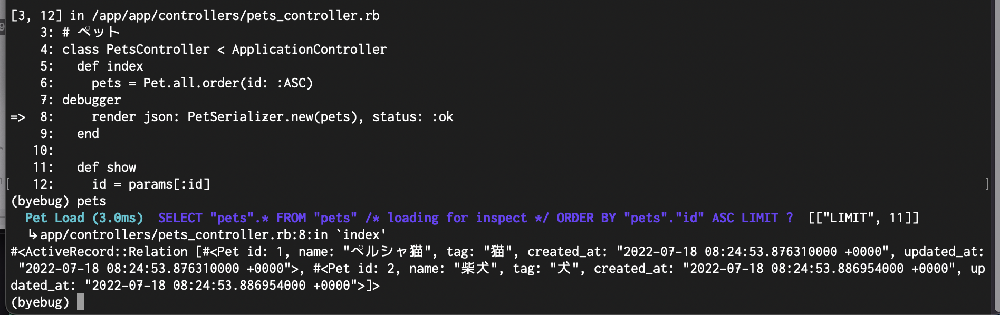
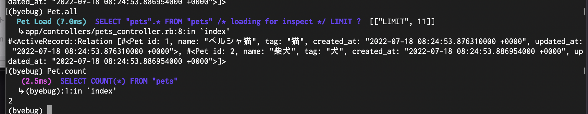

<!-- vscode-markdown-toc -->
* 1. [docker 環境構築 (省略)](#docker)
* 2. [docker で rails を起動する](#dockerrails)
* 3. [ログを見る](#)
* 4. [debug する](#debug)
	* 4.1. [break-point を設定する](#break-point)
	* 4.2. [変数の値を見る](#-1)
	* 4.3. [DB 内容を調べる](#DB)
	* 4.4. [ステップ実行する](#-1)
	* 4.5. [終了する](#-1)
	* 4.6. [付録](#-1)

<!-- vscode-markdown-toc-config
	numbering=true
	autoSave=true
	/vscode-markdown-toc-config -->
<!-- /vscode-markdown-toc --># rails を デバッグする

この文書では、次のことができるようになることを目指します。
- rails の起動・停止ができる
- rails のログを見ることができる。
- 任意の場所でプログラムを止めて、変数の値を調べることができる。
- DB の内容を調べることができる。
- 停止させた場所から ステップ実行したり、実行継続をさせたりできる。


# rails のデバッグ (local 編)

##  1. <a name='docker'></a>docker 環境構築 (省略)

##  2. <a name='dockerrails'></a>docker で rails を起動する

docker-compose コマンドを何回もつかいます。
キー入力を省略するためにつぎのような alias を設定しておくと良いかもしれません。

```sh
dc_build_nocash='docker-compose build --no-cache'
dc_down='docker-compose down'
dc_exec='docker-compose exec'
dc_logs='docker-compose logs'
dc_ps='docker-compose ps'
dc_restart='docker-compose restart'
dc_run_rm='docker-compose run --rm'
dc_up='docker-compose up'

d_att='docker attach'
d_ps_a='docker ps -a'
```

次のコマンドで, rails が起動します。

```sh
docker-compose up -d
（あるいは dc_up -d)
```

ブラウザで http://localhost:3000 にアクセスしてみてください。
つぎのような表示がされます。



次のコマンドで、rails は終了します。

```sh
docker-compose down
(あるいは dc_down)
```

##  3. <a name=''></a>ログを見る

```sh
tail -f log/development.log
(あるいは dc_logs -f web
 あるいは docker-compose logs -f web )
```

##  4. <a name='debug'></a>debug する

http://localhost:3000/pets にアクセスしたときに どんな json を返そうとしているかを rails 内部で直接しらべてます。

###  4.1. <a name='break-point'></a>break-point を設定する

app/controller/pets_controller.rb の index メソッド中に debug という行を追加します。



そのうえで、 http://localhost:3000/pets にブラウザでアクセスします。

エラーが表示されます。



エラー表示になっている理由は、内部で処理がとまってしまっていて、ブラウザにレスポンスを返せていないからです。

log を見てみます。

```sh
docker-compose logs -f web
(あるいは dc_logs -f web)
```



dbugger の行の次行の頭に "=>" が表示され、ここで処理が止まっていることがわかります。

rails のコンテナにはいって 処理を継続させてみましょう。
docker ps して web のコンテナ id をしらべて、 ’docker attach コンテナ id' を実行します。



dockdr attach （あるいは d_attach) の入力のあとに ENTER キー押下をしてください。

conteinue と 入力すれば、処理が継続され、ブラウザに json が表示されます。


###  4.2. <a name='-1'></a>変数の値を見る

もういちど ブラウザで http://local:3000/pets にアクセスします。
ブレークポイントでとまったら、今度は pets を入力してくだい。

変数 pets の値が表示されます。




###  4.3. <a name='DB'></a>DB 内容を調べる

Pet.all で pets テーブルの内容が見れます。

Pet.count で pesg テーブルの列数が見れます。



###  4.4. <a name='-1'></a>ステップ実行する

break したときに next を実行すれｂさ、その行を実行して、次の行でとまります。

setp を実行すれば、メソッドの中にはいって、メソッド中の最初の行でとまります。

###  4.5. <a name='-1'></a>終了する

 quit と入力すれば、debugge を抜けます。

 debugger 中で continue, step 以外にどんなコマンドが使えるは help を入力して知ることができます。

###  4.6. <a name='-1'></a>付録

ブレークポイントに条件をすることもできます。

```
debugger if 条件
```

と ソースコード中にかえば、条件が成立したときだけストップさせることができます。

ループ中で 2 回目のときだけ止めたい場合などに利用するとよいです。

debugger は、ruby コード中だけでなく、 erb ファイル、slim ファイル中でも指定することができます。
erb ファイルの場合は

```ruby
= debugger
```

slim ファイルの場合は

```ruby
- debugger
```
のように記載します。

ソースコードの変更が反映されない場合は 次のコマンドで rails を再起動できます。

```sh
docker-cmposer restart web
(あるいは dc_restart web)
```

それでもうまくいかない場合は docker-compose down して、再度 docker-conpose up -d するなどしてください。
(docker-compose logs -f web で ログをみて、起動失敗している原因がわかるかもしれません)

tmp/pids/server.pid　が残っているために rails 再起動ができないことがあります。


